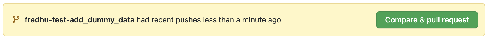
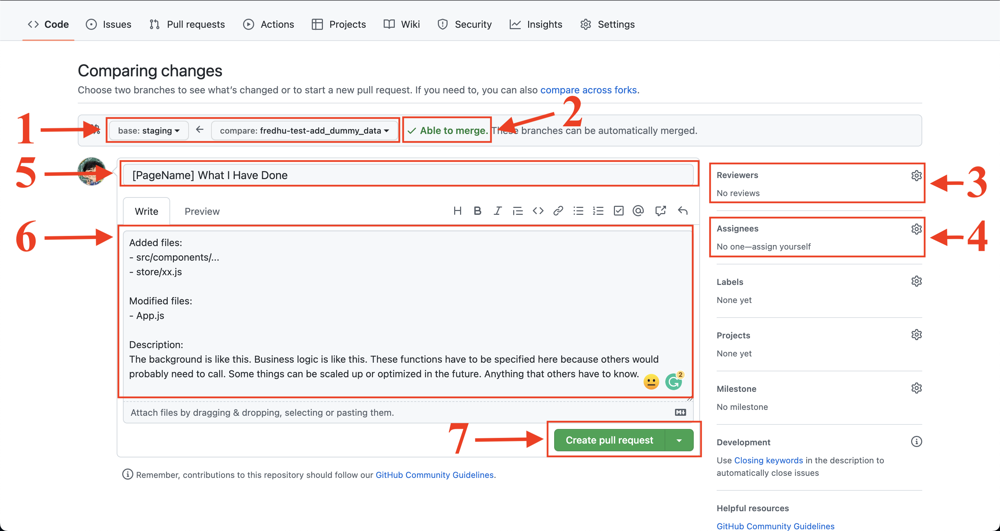
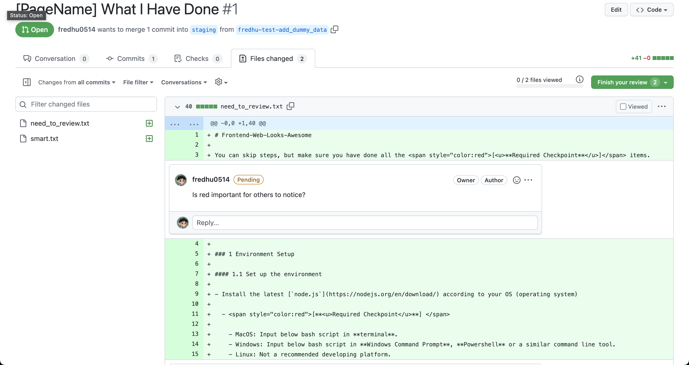

# Frontend-Web-Looks-Awesome

You can skip steps, but make sure you have done all the <span style="color:red">[<u>**Required Checkpoint**</u>]</span> items.

## 1 Environment Setup

### 1.1 Set up the environment

- Install the latest [`node.js`](https://nodejs.org/en/download/) according to your OS (operating system)

  - <span style="color:red">[**<u>Required Checkpoint</u>**] </span>

    - MacOS: Input below bash script in **terminal**.
    - Windows: Input below bash script in **Windows Command Prompt**, **Powershell** or a similar command line tool.
    - Linux: Not a recommended developing platform.

    ```bash
    node -v
    npm -v
    ```

    You should see a version number for each command. Make sure that `Node >= 14.0.0` and `npm >= 5.6`.

  - Bug Fix

    - Case "Command not found", checkout [here](https://stackoverflow.com/questions/27966258/nodejs-installed-without-npm).
    - Case still have problem, reach out @fredhu0514.

- Install the latest [Git](https://git-scm.com/book/en/v2/Getting-Started-Installing-Git)

  - MacOS: Input below bash script in **terminal**.

  - Windows: Input below bash script in **Windows Command Prompt**, **Powershell** or a similar command line tool.

    ``` bash
    git --version
    ```

    You should see a version number. Make sure that `git >= 2.30.0`.

### 1.2 Initialize the repository

- <span style="color:red">[**<u>Required Checkpoint</u>**] </span>

  - Clone the repo & enter the folder

    ``` bash
    git clone https://github.com/Beak-Tech/frontend-web-looks-awesome.git
    cd frontend-web-looks-awesome
    ```

  - Install the `node.js` modules

    ``` bash
    npm install
    ```

## 2 Development Camp 

### 2.1 Start a new feature

#### 2.1.1 Pull staging & Create your own feature branch

- <span style="color:red">[**<u>Required Checkpoint</u>**] </span>

  - Create a new branch from **staging**. 

    - Make sure you switched to your new branch.

    ``` bash
    git pull origin staging
    git checkout staging
    git branch <yourname>-<component name>-<feature name> # all in lowercase 
    # e.g. jerryji-hardfilter-create_button
    # e.g. fredhu-navigator-googleauth
    git checkout <branch name you just given>
    git branch # make sure the '*' is in front of your most recently created branch
    ```

  - Install updated `node.js` modules

    - Other developers possibly added new modules, so you have to update your package.

    ``` bash
    npm install
    ```

  - You now can develop your own feature.

#### 2.1.2 Save your changes & Get ready to push

- <span style="color:red">[**<u>Required Checkpoint</u>**] </span>

  - Save your changes to commits

    - Whenever you reach a small milestone, create a commit (better not contain any bug)

      ``` bash
      git add .
      git commit -m "<completed feature and brief information>"
      # e.g. git commit -m "add google auth button; to fix safari browser hidden case"
      ```

  - Solve all the conflicts before push

    - Since many developers are developing at the same time. We cannot make sure that the same file won't be visited at the same time. Thefore, before pushing your branch to the remote repo, do `rebase` or `merge` first.

      - Merge

        ``` bash
        # Currently should on your own branch with all codes just committed
        git checkout staging
        git pull
        git checkout <your feature branch to push>
        git merge staging
        # After solve all the conflicts, add & commit again, and push to origin
        ```

      - Rebase

        ``` bash
        # Currently should on your own branch with all codes just committed
        git rebase origin staging
        # After solve all the conflicts, add & commit again, and push to origin
        ```

      <sup>*Difference is in which two conflict commits are about to merge. In merge case, two commits are the latest commit of staging branch and the latest commit of your feature branch. In rebase case, two commits are the latest commit of staging branch and the earliest commit of your feature branch. </sup>

#### 2.1.3 Make a PR (Pull Request)

- <span style="color:red">[**<u>Required Checkpoint</u>**] </span>

  - Open Github our repo page and you can see a green button "**Compare & pull request**" after you just push your new feature branch to the repo.

    

  - Click on that button, and you should see this

    

    1. All feature branchs merge only to`staging` branch.
    2. Be sure this is always `Able to merge`. If not, please repeat [**step 2.1.2**](#2.1.2-save-your-changes-&-get-ready-to-push) until it is able to merge. (Conflict because someone's code merged after you made this PR)
    3. Add @fredhu0514 as the reviewer, and you should see a yellow button (means not reviewed yet).
    4. Add yourself to the assignees.
    5. Write the title concise and nicely in the form of `[Page] Features`.
    6. Write the PR message according to the template in the picture above.
    7. Do not foget to click the Create pull request button!

  - After the PR is made, you still need to monitor the PR before it is closed.

    

    Your reviewer will make comments on your codes, and you need to solve all the comments and push the latest commit to the branch.

- Two PRs are provided here as examples.

  - [[Navigator] Added Google Auth Button](https://github.com/Beak-Tech/frontend-web-looks-awesome/pull/3)
  - [[EventDisplayGuest] Realized Guest View Events Layouts & Logic](https://github.com/Beak-Tech/frontend-web-looks-awesome/pull/2)

## 3 Code Structure

### 3.1 Files

``` bash
.
├── README.md
├── public
│   ├── index.html [1]
│   └── robots.txt [2]
└── src
    ├── App.js [3]
    ├── index.js [4]
    ├── components [5]
    │   ├── gadgets [6]
    │   │   └── ... 
    │   ├── layouts [7]
    │   │   └── ...
    │   └── pages [8]
    │       ├── Events [8.1]
    │       │   └── ...
    │       └── HardFilter [8.2]
    │           └── ...
    ├── pages [9]
    │   └── ...
    └── store [10]
        └── ...
```

#### 3.1.1 Displayed html page

#### 3.1.2 Anti web scrawler

#### 3.1.3 Routes

#### 3.1.4 Page layout and global useState achieved by useContext

#### 3.1.5 Contains all layouts and real html code snippets

#### 3.1.6 Small reusable html components

#### 3.1.7 Large reusable page template

#### 3.1.8 Pages layout combination and adjustment. Serves as callee of 3.1.9.

#### 3.1.8.1 Main layout of results display without login. Serves as an example.

#### 3.1.8.2 Main layout of results display without login. Serves as an example.

#### 3.1.9 Interation with backend logic and caller of 3.1.8.

#### 3.1.10 Maintain useContext variables here.
